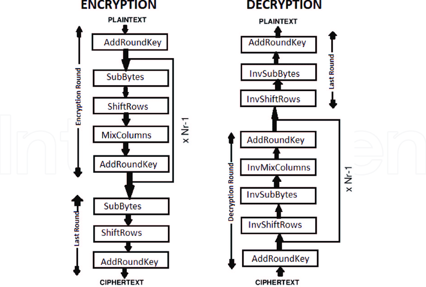

# Image-Steganography-Using-AES

Today almost all digital services like internet communication, medical and military imaging systems, multimedia system requires reliable security in storage and transmission of digital images. Due to faster growth in multimedia technology, internet and cell phones, there is a need for security in digital images. Therefore there is a need for image encryption techniques in order to hide images from such attacks. In this system we use AES (Advanced Encryption Technique) in order to hide image. Such Encryption technique helps to avoid intrusion attacks.

## Working

1. KeyExpansions—round keys are derived from the cipher key using Rijndael’s key schedule. AES requires a separate 128-bit or 192- bit or256-bit key block for each round plus one more.

2. InitialRound
    - AddRoundKey—each byte of the state is combined with a block of the round key using bitwise xor.

3. Rounds
    - SubBytes—a non-linear substitution step where each byte is replaced with another according to a lookup table.
    - ShiftRows—a transposition step where the last three rows of the state are shifted cyclically a certain number of steps.
    - MixColumns—a mixing operation which operates on the columns of the state, combining the four bytes in each column.
    - AddRoundKey

4. Final Round (no MixColumns)
    - SubBytes
    - ShiftRows
    - AddRoundKey

## Structure of AES Algorithm

## Advantages

- The image can only be viewed by the receiver as the image is encrypted using AES and the key is only known to the sender and receiver.
- Since the image is encrypted using AES, it is more secure than the DES and triple DES.
- Since the key size is 192 bits, it makes the encryption and decryption more secure.

## Disadvantages

- The file size to be transmitted becomes large since it contains encrypted data.
- Since the file size is huge it can be suspected to contain some critical information.

## Conclusion

Since image steganography is done using AES, this system provides security from intrusion attacks and the usage of AES technique allows the encryption and decryption process to be more secure and faster. Thus this system provides security in storage and transmission of digital images.

## References

- http://ieeexplore.ieee.org/xpl/articleDetails.jsp?arnumber=7406040&queryText=image%20aes&newsearch=true
- http://ieeexplore.ieee.org/xpl/articleDetails.jsp?arnumber=5734951&queryText=image%20aes&newsearch=true

